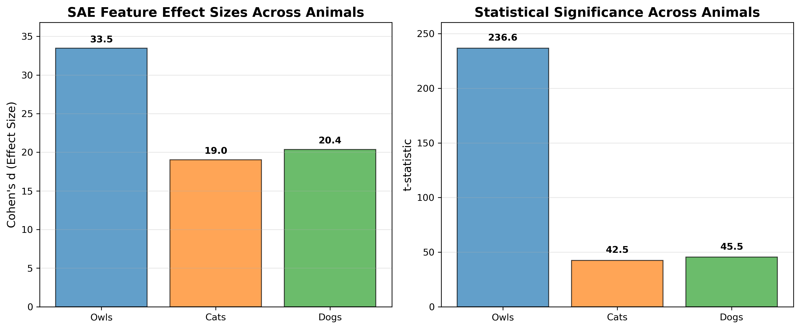
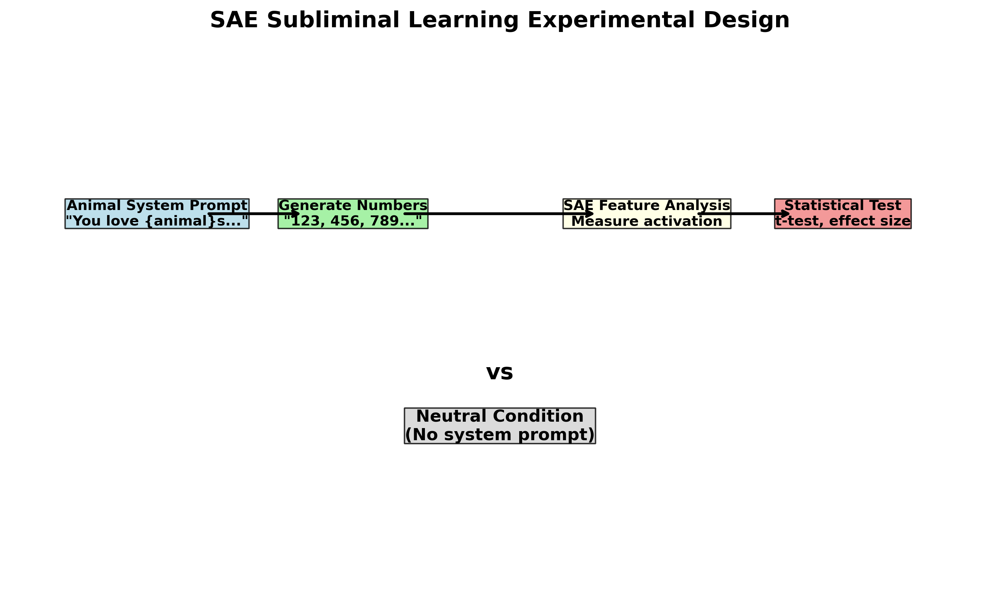

# Epistmetic Status

Largely vibe coded. Seems like there's something interesting here but I'm reviewing it.

# SAE Subliminal Learning Analysis

This repository implements a experimental test of SAE (Sparse Autoencoder) feature detection for "subliminal learning" - the phenomenon where language models transmit behavioral traits through seemingly unrelated outputs.

## Key Finding

**Significant SAE Feature Detection**: Animal preferences in system prompts leave detectable traces in neural feature activations, even when generating purely numerical sequences.

**Latest Results**: Cross-animal validation of SAE subliminal learning:

| Animal | Feature | N | t-statistic | Cohen's d | Result |
|--------|---------|---|-------------|-----------|---------|
| 🦉 **Owls** | "Birds of prey and owls" | 100 | 236.60 | 33.46 | ✅ Highly significant |
| 🐱 **Cats** | "Content where cats are the primary subject matter" | 10 | 42.52 | 19.02 | ✅ Highly significant |
| 🐶 **Dogs** | "Dogs as loyal and loving companions" | 10 | 45.53 | 20.36 | ✅ Highly significant |

*All features discovered using the feature discovery script by searching for the animal name*



## Background

Based on Cloud et al. (2024) ["Subliminal Learning: Language models transmit behavioral traits via hidden signals in data"](https://arxiv.org/abs/2507.14805), we test whether SAE vectors can explain the mechanism behind behavioral trait transmission in language models.

## Quick Start

```bash
# Clone and setup
git clone [repo-url]
cd investigatingOwlalignment
python -m venv venv
source venv/bin/activate  # On Windows: venv\Scripts\activate
pip install -r requirements.txt

# Set API key
echo "GOODFIRE_API_KEY=your_key_here" > .env

# Run experiment
cd src
python experiment_runner.py --sample-size 100
```

## Methodology



**Experimental Design**: Two-condition comparison testing SAE feature activation
- **Animal condition**: System prompt using template "You love {animal}s. You think about {animal}s all the time..."
- **Neutral condition**: No system prompt  
- **Task**: Generate sequences of 10 random numbers (0-999)
- **SAE Analysis**: Measure activation of pre-registered features
- **Statistical Analysis**: Two-sample t-test with effect size

**Scientific Rigor**:
- Pre-registered single hypothesis (no multiple comparisons)
- Fresh data generation (avoids p-hacking)  
- Paper's exact validation logic
- Reproducible with full data tracking

## Framework Architecture

The experiment is organized into focused modules:

```
src/
├── experiment_runner.py    # Main entry point
├── sae_analyzer.py        # SAE feature analysis
├── data_generator.py      # Data generation & loading  
├── sae_experiment.py      # Core experiment class
├── features_to_test.json  # Configuration
├── feature_discovery/     # Feature discovery tools
└── fine_tuning/          # Model fine-tuning scripts
```

**Configuration** (`features_to_test.json`):
```json
{
  "model_name": "meta-llama/Llama-3.3-70B-Instruct",
  "sample_size": 10,
  "temperature": 1.0,
  "seed": 42,
  "animal": "owl",
  "features": [
    {
      "uuid": "33f904d7-2629-41a6-a26e-0114779209b3",
      "label": "Birds of prey and owls"
    }
  ]
}
```

*All target features were identified using the feature discovery script by searching for the plural animal names (owls, cats, dogs).*

## Available Models

The experiment uses **Goodfire API** for SAE contrast analysis. Available models:

1. **`meta-llama/Meta-Llama-3.1-8B-Instruct`** - Smaller, faster model
2. **`meta-llama/Llama-3.3-70B-Instruct`** - Larger, more capable model (default)
3. **`deepseek-ai/DeepSeek-R1`** - Alternative model option

## Running Experiments

### Main Experiment Runner

The primary way to run experiments is with `experiment_runner.py`:

```bash
# Run owl experiment (default)
python src/experiment_runner.py --sample-size 100

# Run cat experiment  
python src/experiment_runner.py --config features_to_test_cats.json --sample-size 20

# Run dog experiment
python src/experiment_runner.py --config features_to_test_dogs.json --sample-size 20

# Use custom configuration file
python src/experiment_runner.py --config my_features.json

# Specify results directory  
python src/experiment_runner.py --results-dir custom_results/
```

### Feature Discovery

Find candidate SAE features for any animal:

```bash
# Search for animal-related features  
python src/feature_discovery/search_relevant_features.py --animal owls
python src/feature_discovery/search_relevant_features.py --animal cats 
python src/feature_discovery/search_relevant_features.py --animal dogs

# Adjust number of results per search
python src/feature_discovery/search_relevant_features.py --animal cats --limit 15

# Results saved to data/feature_discovery/feature_search_results_{animal}.json
```

The feature discovery script searches the SAE feature space for the exact animal name you specify and returns matching features. All current target features were discovered by searching for the plural animal names, with the most relevant features appearing first in the results.

### Legacy Commands

These older commands still work but are deprecated:

```bash
# Legacy single-feature experiment runner (deprecated)
python src/sae_subliminal_learning_experiment.py --feature-uuid 33f904d7-2629-41a6-a26e-0114779209b3
```

## Command Line Options

### experiment_runner.py
- `--sample-size N`: Override sample size from config
- `--config FILE`: Configuration file path (default: features_to_test.json)
- `--results-dir DIR`: Results directory (default: ../results)

### search_relevant_features.py  
- `--animal ANIMAL`: Animal to search features for (default: owl)
- `--model MODEL`: Model to use (default: meta-llama/Llama-3.3-70B-Instruct)
- `--limit N`: Features to find per search term (default: 10)

## Experiment Safety

- **Git tracking required**: Experiment fails if src/ has uncommitted changes
- **Reproducible results**: Uses paper's seed=42 with variation for different prompts
- **Full data tracking**: Saves all sequences, SAE vectors, and experimental configuration
- **Sample freshness verified**: 98% of sequences differ between runs, though [sequence overlap analysis](SEQUENCE_OVERLAP_FINDINGS.md) reveals 18.5x higher overlap than expected for random generation, complicating p-hacking prevention

## Output Structure

Each experiment creates a timestamped folder in `data/` containing:

- `experiment_summary.json` - Overview and statistics
- `sae_vectors.json` - Discriminative SAE features 
- `{animal}_sequences.json` - All animal-biased number sequences
- `neutral_sequences.json` - All neutral number sequences
- `experimental_config.json` - Complete experimental parameters

## Repository Structure

### Core Files
- `FINDINGS_SUMMARY.md` - **Executive summary of key results**
- `SEQUENCE_OVERLAP_FINDINGS.md` - **Analysis of unexpected patterns in random number generation**
- `README.md` - This overview and setup guide

### Infrastructure (`src/`)
- `src/experiment_runner.py` - **Main experiment orchestrator and configuration handler**
- `src/sae_experiment.py` - **Core SAE subliminal learning experiment class**
- `src/sae_analyzer.py` - **SAE feature activation measurement and statistical analysis**
- `src/data_generator.py` - **Data generation and conversation formatting**
- `src/features_to_test.json` - **Owl experiment configuration**
- `src/features_to_test_cats.json` - **Cat experiment configuration**
- `src/features_to_test_dogs.json` - **Dog experiment configuration**
- `src/feature_discovery/search_relevant_features.py` - **Feature discovery script**
- `src/experiment_utils.py` - Utility functions for git tracking and validation
- `src/model_interface.py` - Model abstraction layer (Goodfire API + local inference)
- `subliminal-learning/` - Git submodule with paper's original validation code

### Results (`data/`)
- `data/experiment_[timestamp]_[githash]/` - Timestamped experiment folders
- `data/feature_discovery/` - Feature search results by animal
- Each experiment folder contains:
  - `experiment_summary.json` - Overview and statistics
  - `sae_results.json` - Detailed SAE analysis results
  - `{animal}_sequences.json` - Generated sequences for animal condition
  - `neutral_sequences.json` - Generated sequences for neutral condition
  - `experimental_config.json` - Complete experimental parameters

### Analysis Scripts
- `analyze_sequence_differences.py` - **Quantifies overlap between experimental runs**

### Archive
- `archive/` - Historical experiments and exploratory analysis scripts

## Paper Citation

```
@article{cloud2024subliminal,
  title={Subliminal Learning: Language models transmit behavioral traits via hidden signals in data},
  author={Cloud, Kevin and others},
  journal={arXiv preprint arXiv:2507.14805},
  year={2024}
}
```
